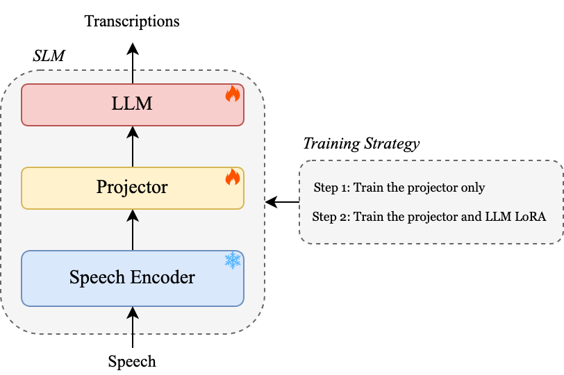
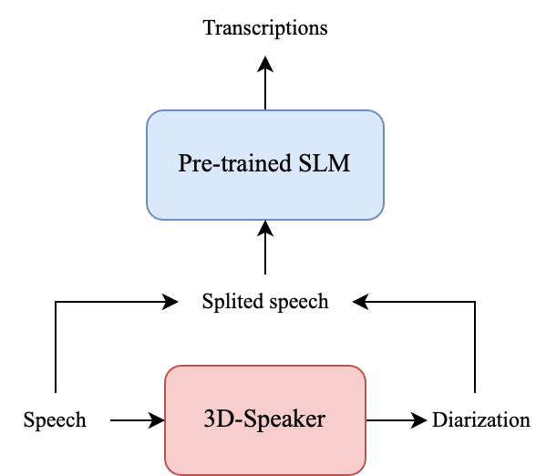

# MLC-SLM Baseline
Large Language Models (LLMs) have demonstrated remarkable capabilities across various downstream tasks, serving as powerful foundation models for language understanding and generation. Recently, there has been significant interest in applying LLMs to speech and audio processing tasks, including Automatic Speech Recognition (ASR), Audio Captioning, and emerging areas such as Spoken Dialogue Models.

However, the development of robust LLM-based Spoken Dialogue Models relies heavily on real-world conversational speech data, which encapsulates the complexity of human communication, including natural pauses, interruptions, speaker overlaps, and diverse conversational styles. The scarcity of such data, especially in multilingual contexts, poses a significant challenge to advancing the field.

The importance of real-world conversational speech extends beyond technological advancement—it is essential for building AI systems that can understand and respond naturally in multilingual, dynamic, and context-rich environments. This is especially crucial for next-generation human-AI interaction systems, where spoken dialogue is a primary communication mode.

Thus, this workshop aims to bridge the gap by hosting the challenge of building multilingual conversational speech language models (MLC-SLM) together with the release of a real-world multilingual conversational speech dataset.

The challenge consists of two tasks, both of which require participants to explore the development of speech language models (SLMs):

***Task I: Multilingual Conversational Speech Recognition***

***Task II: Multilingual Conversational Speech Diarization and Recognition***

This project provides baseline systems for the two tasks mentioned above!

## Setup
* Clone the repo
```shell
git clone https://github.com/mubingshen/MLC-SLM-Baseline.git
```
* Install requirements
```shell
pip install -r requirements.txt
```
## Introduction

* [Task I](./examples/mlcslm/asr): Follow the detailed steps in `./examples/mlcslm/asr`
* [Task II](./examples/mlcslm/sdasr): Follow the detailed steps in `./examples/mlcslm/sdasr`

## To-do list
- [x] Task I ASR baseline with vanilla whisper-large-v3 encoder & Qwen2.5-7B
- [x] Task I ASR baseline with vanilla whisper-large-v3 encoder & Llama3.1-8B will be coming soon
- [x] Task II speaker diarization baseline will be coming soon

## Baseline Results on the Dev set
## Task I: Multilingual Conversational Speech Recognition



**Baseline-Qwen**: Vanilla Whisper-large-v3 Encoder + Qwen2.5-7B

**Baseline-Llama**: Vanilla Whisper-large-v3 Encoder + Llama3.1-8B

**Training steps**:
* Step 1: Train the projector between the encoder and LLM
* Step 2: Load the projector trained in the first step, and then train the projector and LLM LoRA simultaneously

**Evaluation matrix**: Word Error Rate (WER) or Character Error Rate (CER)

| LID                | Vanilla Whisper-large-v3    | Baseline-Qwen | Baseline-Llama |
|--------------------|-----------------------------|---------------|----------------|
| English-American   | 14.14                       | 14.04         | 17.45          |
| English-Australian | 11.72                       | 11.60         | 13.77          |
| English-British    | 10.08                       | 11.37         | 12.09          |
| English-Filipino   | 9.20                        | 8.15          | 8.43           |
| English-Indian     | 13.96                       | 17.73         | 16.22          |
| French             | 26.72                       | 25.33         | 26.84          |
| German             | 20.53                       | 36.64         | 34.06          |
| Italian            | 17.94                       | 24.22         | 24.91          |
| Japanese           | 21.64                       | 34.88         | 34.06          |
| Korean             | 13.80                       | 20.60         | 22.31          |
| Portuguese         | 20.82                       | 36.09         | 33.82          |
| Russian            | 7.36                        | 7.51          | 7.97           |
| Spanish            | 12.24                       | 15.00         | 17.03          |
| Thai               | 14.49                       | 23.10         | 19.98          |
| Vietnamese         | 23.02                       | 18.22         | 19.66          |
| Avg.               | 15.36                       | 19.82         | 19.74          |

## Task II: Multilingual Conversational Speech Diarization and Recognition



**Baseline**: 3D-Speaker Diarization + Task I pre-trained SLM model

**Training steps**:
* Step 1: Finetune the pyannote-segmetation module with `./examples/mlcslm/sdasr/finetune_sd.sh`
* Step 2: Load the segmentation module in the first step, and infer dev-set with `./examples/mlcslm/sdasr/infer_sd.sh`

**Evaluation matrix**: Diarization Error Rate (DER)

| LID                | w/o overlap 3D-Speaker | w/ overlap 3D-Speaker |
|--------------------|------------------------|-----------------------|
| English-American   | 20.18                  | 22.37                 |
| English-Australian | 13.76                  | 14.00                 |
| English-British    | 18.85                  | 19.52                 |
| English-Filipino   | 13.19                  | 12.67                 |
| English-Indian     | 8.19                   | 8.03                  |
| French             | 22.62                  | 23.50                 |
| German             | 22.33                  | 24.17                 |
| Italian            | 10.64                  | 11.55                 |
| Japanese           | 26.46                  | 26.32                 |
| Korean             | 23.25                  | 25.45                 |
| Portuguese         | 17.60                  | 17.99                 |
| Russian            | 11.37                  | 12.15                 |
| Spanish            | 12.92                  | 13.44                 |
| Thai               | 10.90                  | 11.32                 |
| Vietnamese         | 14.64                  | 15.30                 |
| Avg.               | 16.44                  | 17.16                 |

Time-Constrained minimum-Permutation Word Error Rate (tcpWER) with collar = 5

| LID                | w/o overlap 3D-Speaker + Baseline-Llama | w/ overlap 3D-Speaker + Baseline-Llama |
|--------------------|-----------------------------------------|----------------------------------------|
| English-American   | 53.73                                   | 70.33                                  |
| English-Australian | 52.63                                   | 60.77                                  |
| English-British    | 71.92                                   | 77.17                                  |
| English-Filipino   | 50.37                                   | 58.87                                  |
| English-Indian     | 70.72                                   | 69.19                                  |
| French             | 96.04                                   | 104.54                                 |
| German             | 86.74                                   | 95.17                                  |
| Italian            | 83.31                                   | 84.01                                  |
| Japanese           | 159.44                                  | 382.85                                 |
| Korean             | 72.19                                   | 91.62                                  |
| Portuguese         | 118.84                                  | 106.89                                 |
| Russian            | 69.21                                   | 84.53                                  |
| Spanish            | 75.61                                   | 82.25                                  |
| Thai               | 149.24                                  | 169.85                                 |
| Vietnamese         | 82.80                                   | 91.96                                  |
| Avg.               | 78.34                                   | 87.41                                  |


## Contact US
* Bingshen Mu: `bsmu@mail.nwpu.edu.cn`.